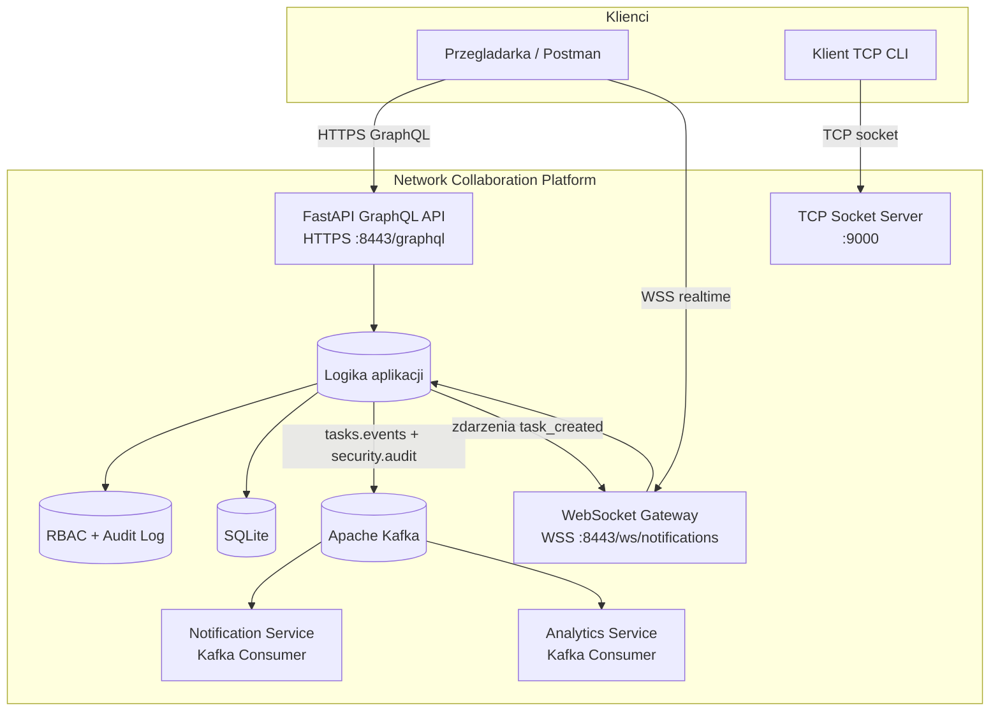

# Diagram architektury systemu



## Komponenty i role

1. FastAPI GraphQL API (HTTPS)
   - Jedyny interfejs aplikacyjny: zapytania (`Query`) i mutacje (`Mutation`) GraphQL.
   - Uwierzytelnienie oparte o token przesylany w naglowku `X-Auth-Token`.
   - Dostepne operacje: `register`, `login`, `createTask`, `me`, `tasks`, `auditLogs`.

2. WebSocket Gateway
   - Utrzymuje stale polaczenie z klientem.
   - Dostarcza powiadomienia w czasie rzeczywistym po utworzeniu zadania.

3. TCP Socket Server
   - Niskopoziomowy serwer czatu oparty bezposrednio na interfejsie socket.
   - Wlasny protokol tekstowy: `NICK:<name>`, `MSG:<text>`, `QUIT`.

4. SQLite
   - Trwala baza danych dla uzytkownikow, sesji i zadan.

5. Apache Kafka
   - Publikacja zdarzen asynchronicznych (`tasks.events`, `security.audit`).
   - Integracja uruchamiana standardowo w srodowisku Docker Compose wraz z konsumentami zdarzen.

6. Notification Service
   - Konsument zdarzen Kafki uruchamiany jako osobny serwis kontenerowy.
   - Odpowiada za przetwarzanie strumienia zdarzen powiadomien.

7. Analytics Service
   - Konsument zdarzen Kafki odpowiedzialny za agregacje licznikow i obserwowalnosc przeplywu.

8. Warstwa bezpieczenstwa (RBAC + Audit)
   - RBAC: role `admin` i `user` do kontroli dostepu do zasobow administracyjnych.
   - Audit log: trwale logowanie operacji uwierzytelniania, autoryzacji i zdarzen WebSocket.

---

## Szczegółowy opis komponentów

### Hierarchia komponentow (stack technologiczny)

- **Zookeeper**
  - Koordynator Kafki — zarzadza stanem brokerow, partycjami i wyborami liderow.
  - Port: `2181/tcp`
  - W projekcie: 1 instancja (standalone) wystarczajaca do celow demonstracyjnych.

- **Apache Kafka**
  - Broker wiadomosci — przyjmuje zdarzenia od producentow i rozdziela je do konsumentow.
  - Port: `9092/tcp` (host), `29092/tcp` (wewnetrzna siec Docker)
  - Tematy (topics):
    - `tasks.events` — zdarzenia biznesowe (utworzenie zadania)
    - `security.audit` — zdarzenia bezpieczenstwa (logowanie, RBAC, WebSocket)

- **API (FastAPI + Strawberry GraphQL)**
  - Producent Kafki: publikuje eventy do obu topicow.
  - WebSocket Hub: broadcast `task_created` do wszystkich podlaczonych klientow.
  - SQLite: persystencja uzytkownikow, sesji, zadan i logow audytu.
  - RBAC: pierwszy rejestrujacy uzytkownik dostaje role `admin`, kolejni `user`.
  - Port: `8443/tcp` (HTTPS + WSS)

- **Notification Service** (konsument Kafki)
  - Grupa: `notification-service`
  - Subskrybuje: `tasks.events` + `security.audit`
  - Dzialanie: wypisuje kazdy odebrany event na stdout (widoczne w `docker compose logs`)

- **Analytics Service** (konsument Kafki)
  - Grupa: `analytics-service`
  - Subskrybuje: `tasks.events` + `security.audit`
  - Dzialanie: zlicza eventy per topic (`Counter`) i wypisuje aktualne liczniki

- **TCP Socket Server**
  - Wlasny protokol tekstowy na surowych gniazdach TCP.
  - Architektura: wielowatkowa, jeden watek per klient.
  - Port: `9000/tcp`

- **Frontend (panel HTML)**
  - Komunikuje sie wylacznie przez GraphQL (fetch POST /graphql).
  - WebSocket: `wss://host:8443/ws/notifications?token=...`

### Przeplyw danych end-to-end (przyklad: tworzenie zadania)

1. Uzytkownik klika **"Dodaj zadanie"** w panelu (lub wysyla mutation przez curl).
2. `POST /graphql` z mutation `createTask` trafia do resolvera w `app/graphql_api.py`.
3. Resolver:
   - Zapisuje zadanie do SQLite (`db.create_task`).
   - Loguje event do tabeli audytu (`db.log_event`).
   - Wysyla event do Kafka topic `tasks.events` (`EventPublisher`).
   - Wysyla event do Kafka topic `security.audit` (automatycznie przez `_audit`).
   - Broadcastuje przez WebSocket Hub do wszystkich polaczonych klientow (`task_created`).
4. Kafka broker odbiera eventy i rozdziela je do konsumentow.
5. **Notification Service** odbiera event i wypisuje go w logach.
6. **Analytics Service** odbiera event i inkrementuje licznik.
7. WebSocket klienta (panel przegladarki) odbiera JSON z nowym zadaniem i wyswietla je w czasie rzeczywistym.

---

## Przykłady operacji i diagnostyki

### 1. Status kontenerow
```bash
docker compose ps
```
Sprawdzamy czy wszystkie uslugi sa `healthy`.

### 2. Logi konsumentow Kafki (live)
```bash
# Terminal 1 — sledzenie powiadomien
docker compose logs -f notification-service

# Terminal 2 — sledzenie analizy / licznikow
docker compose logs -f analytics-service
```

### 3. Tworzenie zadania przez GraphQL (wygeneruje eventy)
```bash
curl -k -X POST https://127.0.0.1:8443/graphql \
  -H "Content-Type: application/json" \
  -H "X-Auth-Token: <TOKEN_ADMIN>" \
  -d '{"query":"mutation { createTask(title: \"Live demo\", description: \"Kafka + WebSocket test\") { id title owner } }"}'
```

### 4. Wlasny protokol TCP (dwa terminale)
```bash
# Terminal 1
python -m tcp.client
# NICK:Alice
# MSG:Hello from TCP

# Terminal 2
python -m tcp.client
# NICK:Bob
# (Bob odbiera broadcast od Alice)
```

### 5. WebSocket realtime (przegladarka + panel)
- Otworz `https://127.0.0.1:8443/`
- Zaloguj sie, polacz WebSocket (przycisk **Connect WS**)
- Dodaj zadanie przez panel — zaobserwuj event `task_created` w konsoli WebSocket

### 6. Testy automatyczne (szybka weryfikacja)
```bash
docker compose run --rm -e PYTHONPATH=/app api pytest -q
```
