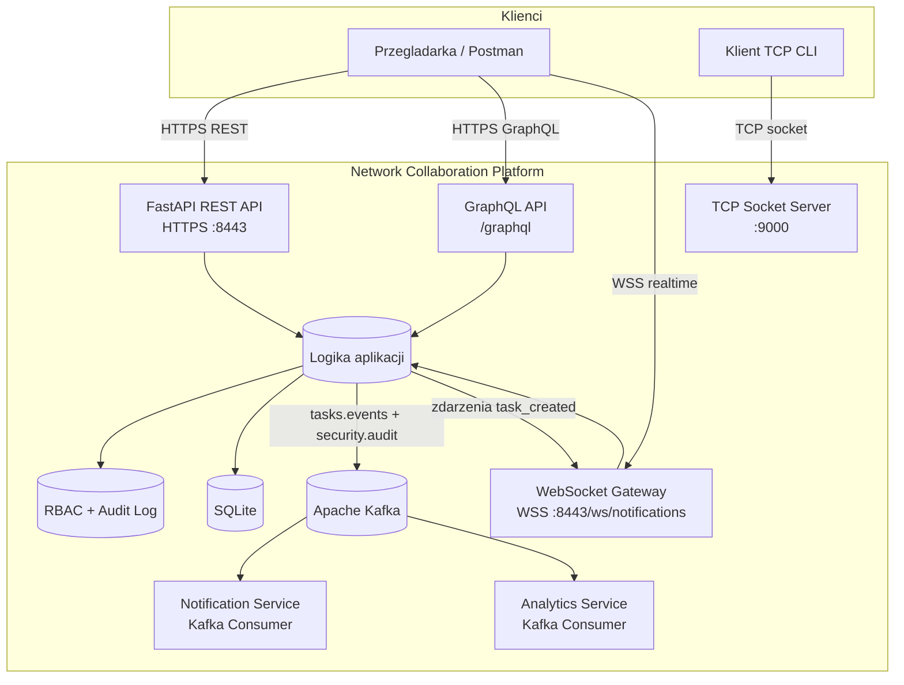

# Diagram architektury systemu

## Infogram (Mermaid)

## Komponenty i role

1. FastAPI REST API (HTTPS)
- Endpointy rejestracji, logowania i zarzadzania zadaniami.
- Interfejs bezstanowy: kazde zadanie REST niesie token sesji w naglowku.

2. WebSocket Gateway
- Utrzymuje stale polaczenie z klientem.
- Dostarcza powiadomienia w czasie rzeczywistym po utworzeniu zadania.

3. GraphQL API
- Zapytania agregujace dane aplikacyjne (`me`, `tasks`, `audit_logs`).
- Dostep oparty o ten sam token uwierzytelniajacy co REST.

4. TCP Socket Server
- Niskopoziomowy serwer czatu oparty bezposrednio na interfejsie socket.
- Wlasny protokol tekstowy: `NICK:<name>`, `MSG:<text>`, `QUIT`.

5. SQLite
- Trwala baza danych dla uzytkownikow, sesji i zadan.

6. Apache Kafka
- Publikacja zdarzen asynchronicznych (`tasks.events`, `security.audit`).
- Integracja z API w trybie opcjonalnym (dzialanie bez brokera nie powoduje awarii aplikacji).

7. Notification Service
- Konsument zdarzen Kafki uruchamiany jako osobny serwis kontenerowy.
- Odpowiada za przetwarzanie strumienia zdarzen powiadomien.

8. Analytics Service
- Konsument zdarzen Kafki odpowiedzialny za agregacje licznikow i obserwowalnosc przeplywu.

9. Warstwa bezpieczenstwa (RBAC + Audit)
- RBAC: role `admin` i `user` do kontroli dostepu do endpointow administracyjnych.
- Audit log: trwałe logowanie operacji uwierzytelniania, autoryzacji i zdarzen WebSocket.